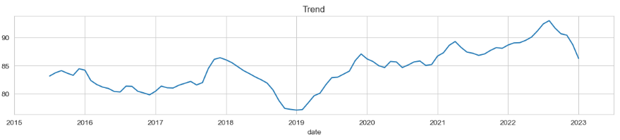
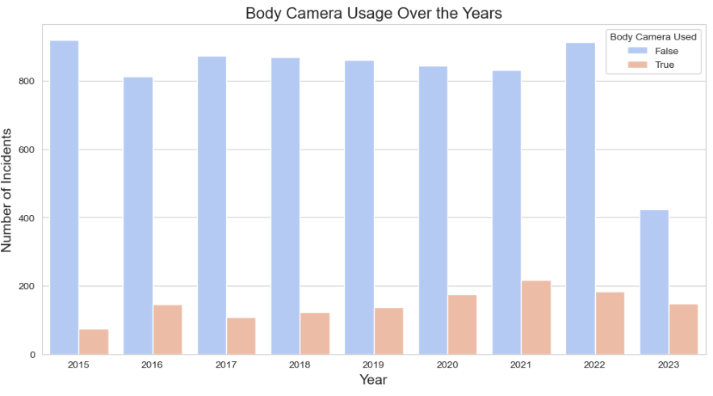
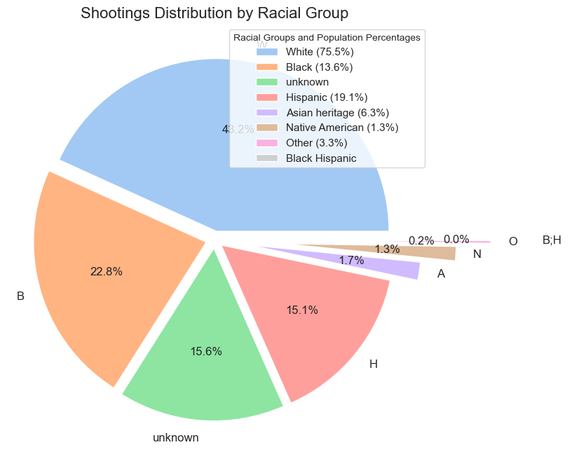

# Fatal Police Shootings in US Analysis

This project analyses Washington Post collected and maintained dataset of fatal shootings executed by police officers in the United States of Amerika (USA) since Jan. 1, 2015. 
This analysis does some basic exploration of the data: descriptive statistics results interpretations and suggest intuition. Data visualization exploration. Grouping by various aspects and exloration of shootings amoung those groups. This analysis will include some time series exploration, seasonality analysis and geograpic (US states bases) exploration of the shooting.

## Examples of findings

### Shootings Trend Over Time


### Shootings by Camera Usage


### Shootings Distribution by Racial Group


## Some of the insights from the data

- Fatal police shootings show an increasing trend with 2022 marking a 4.58% rise compared to the previous year.
- Guns are the most common weapon involved appearing in over half of the cases (5019 out of 8659).
- Significant racial disparities exist where Black individuals account for 22.8% of fatal shootings despite being only 13.6% of the population, while White individuals make up 43.2% of incidents but 75.5% of the population.
- California has the highest number of incidents (1222) with Los Angeles being a hotspot.
- Seasonal patterns show more shootings in autumn and winter than in spring and summer periods.

For a full analysis including geographic trends and statistical tests see the "Fatal Police Shootings Analysis" notebook.

## Installation

Install the required packages:
```bash
pip install pandas matplotlib seaborn numpy statsmodels plotly scipy.stats sklearn.linear_model
```

## Usage

Download datasets file and place it in the project directory. You can download it from kaggle here: https://github.com/washingtonpost/data-police-shootings/tree/master/v2

## Licence
MIT. See the LICENSE file for more details.
